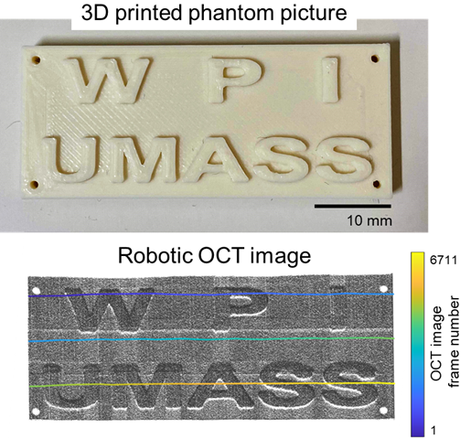

# OCT-Franka bridge & post processing

## Dependencies
- MATLAB ROS toolbox

## Usage
### OCT-Franka bridge through ROS
- franka_2DOCT_bridge.m
- franka_3DOCT_bridge.m

### OCT post processing
#### process data collected using Franka robot
- franka_3DOCT_depth_encoding.m
- franka_3DOCT_extinction_coeff.m
- franka_3DOCT_extinction_coeff2.m
- franka_3DOCT_pointcloud.m
- franka_3DOCT_volume.m
#### process data collected using ThorImageOCT
- thorlabs_3DOCT_extinction_coeff.m 

## Results

