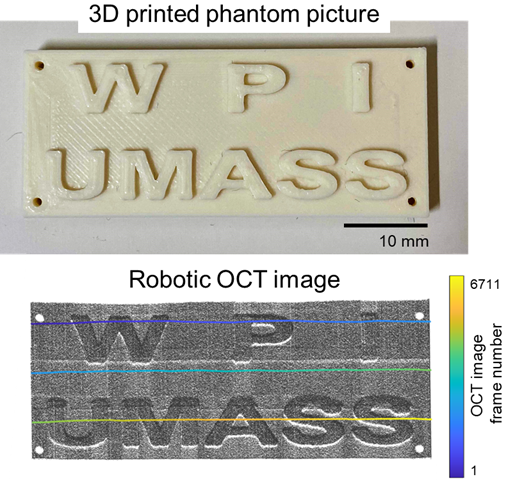

# OCT-Franka bridge & post processing

## Dependencies
- MATLAB ROS toolbox
- MATLAB Image Processing Toolbox

## Usage
### OCT-Franka ROS bridge
- ```franka_2DOCT_bridge.m``` : real-timely send OCT BScan to Franka robot
- ```franka_3DOCT_bridge.m``` : real-timely send OCT volume data to Franka robot (under development)

### OCT post processing
#### process data collected using Franka robot
- ```franka_3DOCT_depth_encoded.m``` : generate 3D depth-encoded map 
- ```franka_3DOCT_attenuation_pc.m``` : generate 3D attenuation map (pointcloud-based)
- ```franka_3DOCT_attenuation_px.m``` : generate 3D attenuation map (pixel-based)
- ```franka_3DOCT_pointcloud.m``` : generate 3D pointcloud
- ```franka_3DOCT_volume.m``` : generate 3D volume
#### process data collected using ThorImageOCT
- ```thorlabs_3DOCT_attenuation_px.m``` : generate 3D attenuation map (pixel-based)

## Utility Functions
### OCT acquisition
- ```LoadSpectralRadar.m```
- ```AcquireSingleBScan.m```
- ```AcquireSingleVolume.m```
- ```UnloadSpectralRadar.m```

### OCT post-processing
- ```FrankaOCTDataManager.m``` : manage collected data using Franka robot
- ```ThorlabsOCTDataManager.m``` : manage collected data using ThorImage software
- ```FilterRawBscan.m```
- ```GetExtCoeff.m``` : calculate attenuation coeffecient for each OCT BScan
- ```TransformPoints.m```
- ```icp.m``` : pointcloud ICP registration

## Example
